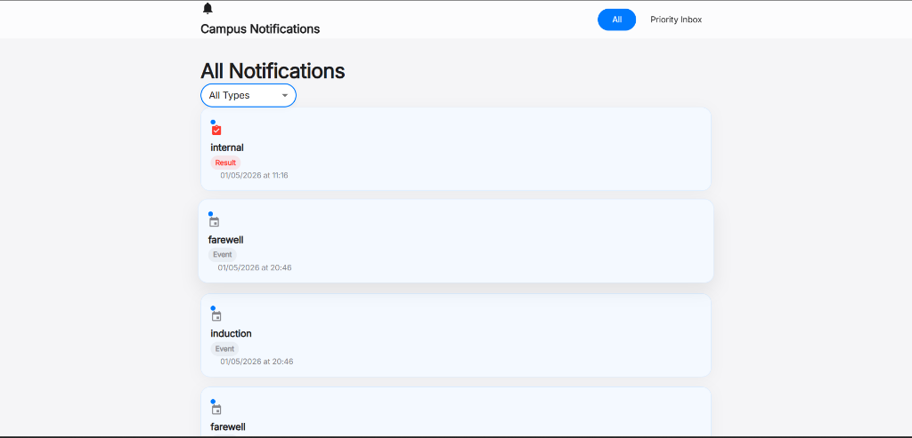
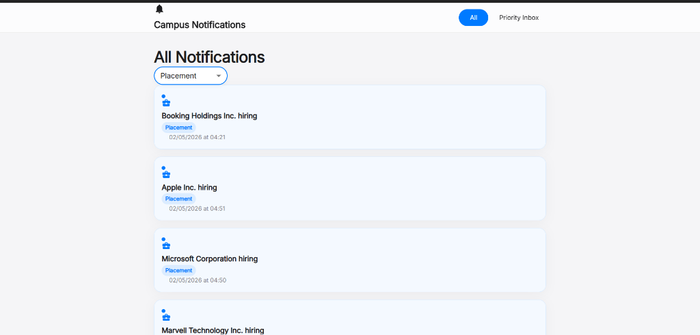
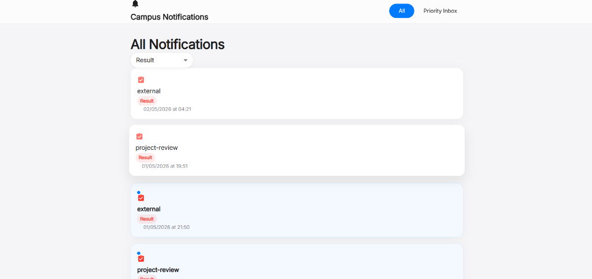
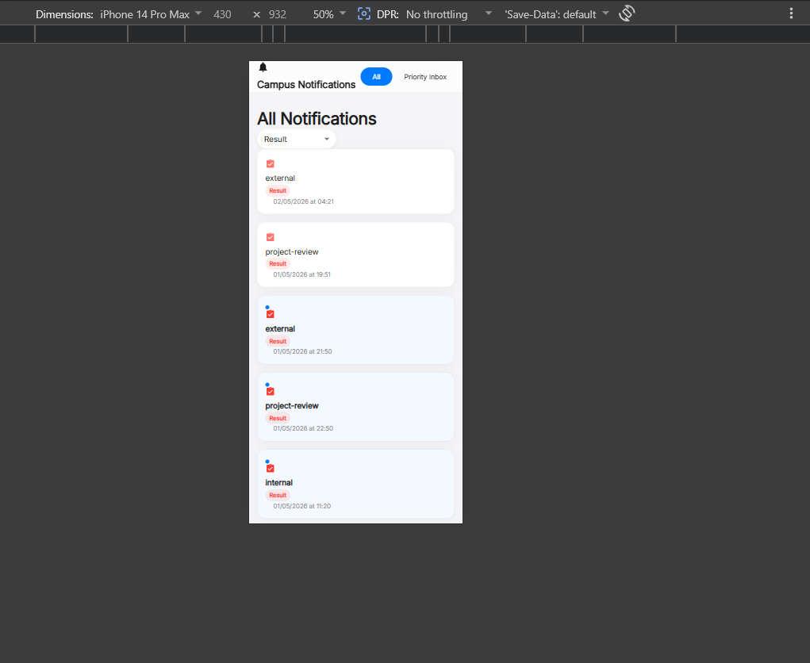
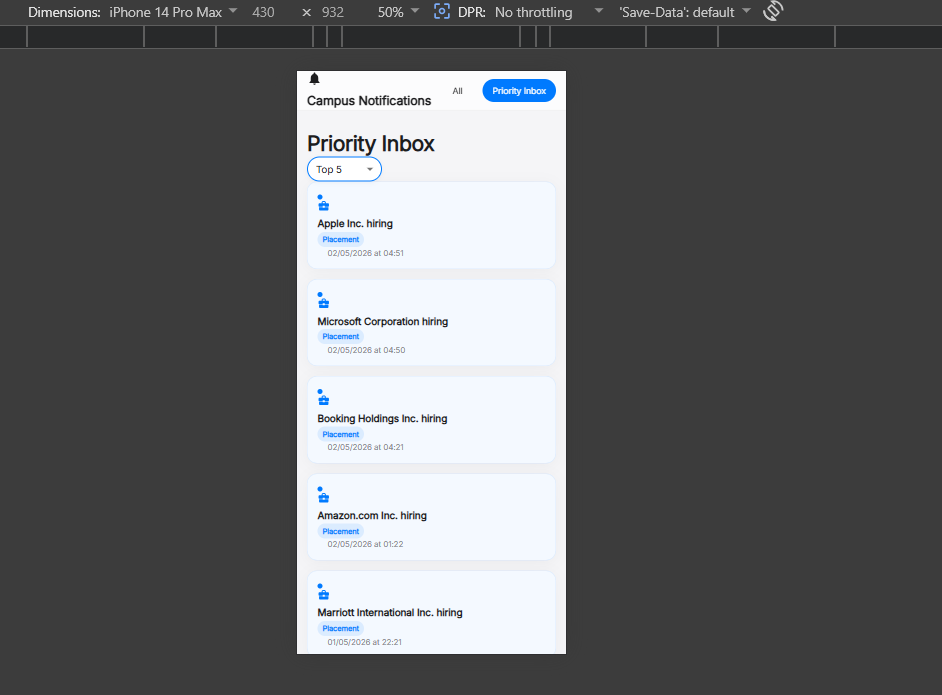

# Campus Notifications System

A sophisticated notification management platform designed to aggregate, categorize, and prioritize campus-wide updates. This system combines a robust backend sorting engine with a high-fidelity, Apple-inspired user interface to deliver a seamless information experience.

---

## 📸 Demo

### 🎬 Screen Recording

> A full walkthrough video demonstrating the application's features is available in the `assets/` directory:
> [`demo.mp4`](./assets/demo.mp4)

### Desktop View

<table>
  <tr>
    <td><strong>All Notifications</strong></td>
    <td><strong>Placement Filter</strong></td>
    <td><strong>Result Filter</strong></td>
  </tr>
  <tr>
    <td></td>
    <td></td>
    <td></td>
  </tr>
</table>

### Mobile Responsive View

<table>
  <tr>
    <td><strong>Result Filter (Mobile)</strong></td>
    <td><strong>Priority Inbox (Mobile)</strong></td>
  </tr>
  <tr>
    <td></td>
    <td></td>
  </tr>
</table>

---

## 🌟 Key Features

- **Automated Authorization Lifecycle:** Built-in security scripts manage and refresh access tokens, ensuring continuous, authorized communication with central data services.
- **Advanced Priority Engine:** Implements a multi-layered sorting algorithm that evaluates notification types (`Placement`, `Result`, `Event`) and chronological relevance to surface the most critical information first.
- **Glassmorphism Design Language:** A modern React interface utilizing frosted-glass effects, refined typography, and responsive layouts for a premium feel across all devices.
- **Persistence Engine:** Integrated local state management that tracks and persists notification interaction history across sessions.
- **Network Resilience:** Native proxy architecture built into the development environment to handle cross-origin resource sharing (CORS) and ensure stable API connectivity.

---

## 🏗️ System Architecture

The project is organized into modular components for scalability and maintainability:

```
RA2311003011138/
├── assets/                      # Screenshots and demo video
├── logging_middleware/           # Telemetry and diagnostic layer
│   └── index.ts
├── notification_app_fe/         # React frontend application
│   ├── src/
│   │   ├── components/          # Reusable UI components
│   │   ├── hooks/               # Custom React hooks
│   │   ├── pages/               # Page-level views
│   │   ├── utils/               # Utility functions
│   │   ├── App.tsx              # Root application component
│   │   └── main.tsx             # Application entry point
│   ├── vite.config.ts           # Build configuration with proxy
│   └── package.json
├── auto_token.js                # Automated token refresh utility
├── config.ts                    # Environment configuration
├── get_new_token.js             # Manual token generation script
├── notification_system_design.md # System design documentation
├── stage1_algorithm.ts          # Core sorting algorithm
└── README.md
```

- **Notification Engine:** The core logic responsible for fetching raw data and applying classification algorithms.
- **React Frontend:** A component-driven UI built with TypeScript and Material UI, focused on performance and high-quality user experience.
- **Telemetry Layer:** A specialized logging middleware that tracks system health and user interactions for diagnostic purposes.
- **Dev-Ops Tooling:** Node.js utilities for environment configuration and secure credential management.

---

## 🚀 Getting Started

### Prerequisites

- Node.js (v18.0.0 or higher)
- npm (v9.0.0 or higher)

### Installation

1. Clone the repository and navigate to the project directory:
   ```bash
   git clone <repository-url>
   cd RA2311003011138
   ```

2. Install dependencies for the frontend application:
   ```bash
   cd notification_app_fe
   npm install
   ```

### Configuration

Before launching the application, you must initialize the secure environment:

1. Update `get_new_token.js` with your specific credentials.
2. Generate a fresh session token:
   ```bash
   node get_new_token.js
   ```

### Development

Start the interactive development server:
```bash
cd notification_app_fe
npm run dev
```
The application will be accessible at `http://localhost:3000`.

---

## 🛠️ Technology Stack

| Layer            | Technology                          |
|------------------|-------------------------------------|
| **Framework**    | React 18                            |
| **Language**     | TypeScript                          |
| **State Mgmt**   | React Hooks                         |
| **Styling**      | Material UI (MUI) & Custom CSS      |
| **Build Tool**   | Vite                                |
| **Networking**   | Axios / Fetch API                   |
| **Runtime**      | Node.js                             |

---

## 📝 Algorithm Details

The **Priority Inbox** utilizes a weighted sorting strategy:

1. **Classification Weight:** `Placement` (High) > `Result` (Medium) > `Event` (Normal).
2. **Chronological Tie-breaking:** Notifications within the same classification are sorted by precise timestamp recency.
3. **Filtering:** Dynamic type-based filtering allows users to isolate specific notification streams.
4. **Top-N Selection:** The Priority Inbox surfaces the most relevant notifications based on configurable thresholds (Top 5, Top 10, etc.).

---

*This project demonstrates a production-grade approach to building information-heavy web applications with a focus on clean code, robust networking, and exceptional design.*
